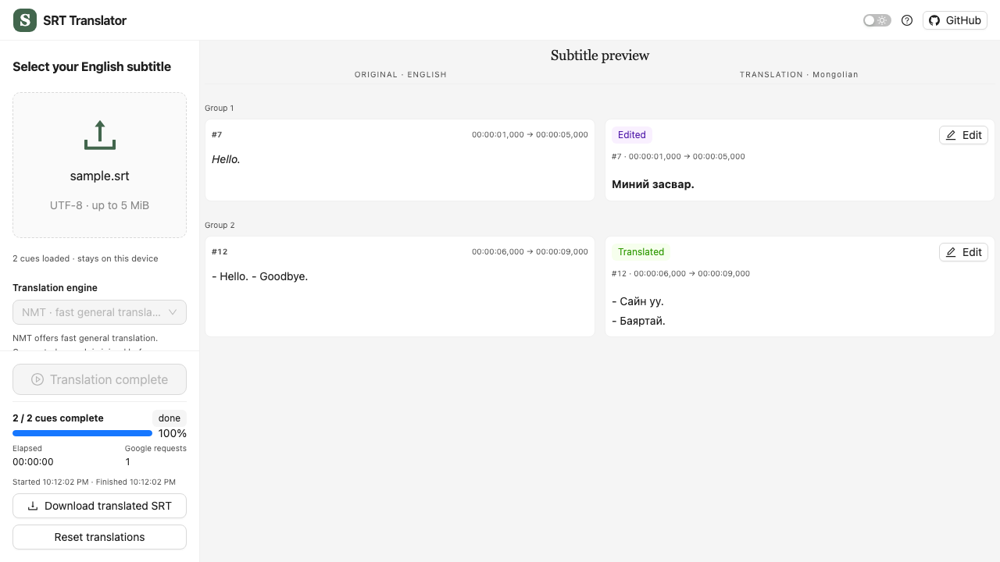

# SRT Translator

Have an English subtitle file but want to watch in another language? Drop in an `.srt`, choose a language, review the translated cues beside the originals, fix anything important, and download a new `.srt` with the original timing.

**Live app:** [srt-translator-tawny.vercel.app](https://srt-translator-tawny.vercel.app)



_Screenshot from a mocked browser test. It demonstrates the interface, not live NMT/TLLM quality._

## Product vision

**FOR** tech-savvy movie viewers who already obtain and use subtitle files,

**WHO** want to enjoy movies in their preferred or mother language,

**THE SRT Translator IS AN** online subtitle translation and review tool

**THAT** joins continuing speech before translation and produces an editable SRT with preserved timing.

**UNLIKE** manually copying subtitle fragments into a general translation website,

**OUR PRODUCT** handles continuation grouping, subtitle readability, progress, editing and download in one workflow.

## At a glance

React, TypeScript, Vite and Ant Design power the browser UI. Node and same-origin Vercel Functions share a small gateway to official Google Cloud Translation NMT/TLLM. The browser calls `/api/translation` and `/api/translation/languages`; the gateway alone holds the owner key. The SRT stays local except for subtitle text sent to the selected translation provider. Joined dialogue is redistributed approximately into the original time slots, so review against the movie still matters.

```text
frontend/  React UI, SRT domain logic, provider client, browser tests
backend/   Shared gateway core, local Node adapter, gateway tests
api/       Tiny root Vercel Function entrypoints (required by Vercel)
docs/      Requirements, decisions, product work, sprints, guides, MVP
```

Root `package.json`, build/test configuration, `AGENTS.md`, project state and AI logs coordinate the two code areas. The professor/Classroom50 starter files remain at their original paths.

## Run locally

Requires Node 22.12+ and npm. From the repository root:

```sh
npm ci
# Copy .env.example to a local .env and set your own server-side values.
npm run dev
```

Open `http://localhost:5173`. `npm run dev` starts both Vite and the local gateway. Never put a key in `VITE_*` variables or commit `.env`. See [gateway setup](docs/guides/GOOGLE_TRANSLATE_SETUP.md) for configuration and the production safety checklist.

```sh
npm run check
npm run format:check
npm run test:e2e
npm run check:build
```

Tests mock Google; live paid translation, language/model coverage and subtitle timing quality require separate checks. Public translation must not be enabled without an owner-approved allowance, rate limiting and Google budget/quota controls.

## Quick links

| Explore | Document |
| --- | --- |
| How the parts fit | [Architecture](docs/ARCHITECTURE.md) · [frontend mechanism](docs/frontend/MECHANISM.md) · [backend mechanism](docs/backend/MECHANISM.md) |
| Product and decisions | [Current stories/personas/gaps](docs/product/README.md) · [requirements](docs/requirements/PRODUCT_REQUIREMENTS.md) · [ADRs](docs/decisions/README.md) |
| Course history | [Issue backlog](docs/planning/BACKLOG.md) · [sprints](docs/sprints/README.md) · [archived MVP](docs/mvp/srt-translator-beta-3.html) · [build evidence](BUILD_LOG.md) |
| AI use | [Short AI log](AI_LOG.md) · [detailed AI log](docs/AI_DETAILED_LOG.md) |
| All documentation | [Docs index](docs/README.md) · [current project state](PROJECT_STATE.md) |
