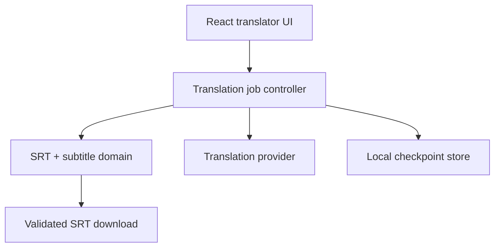
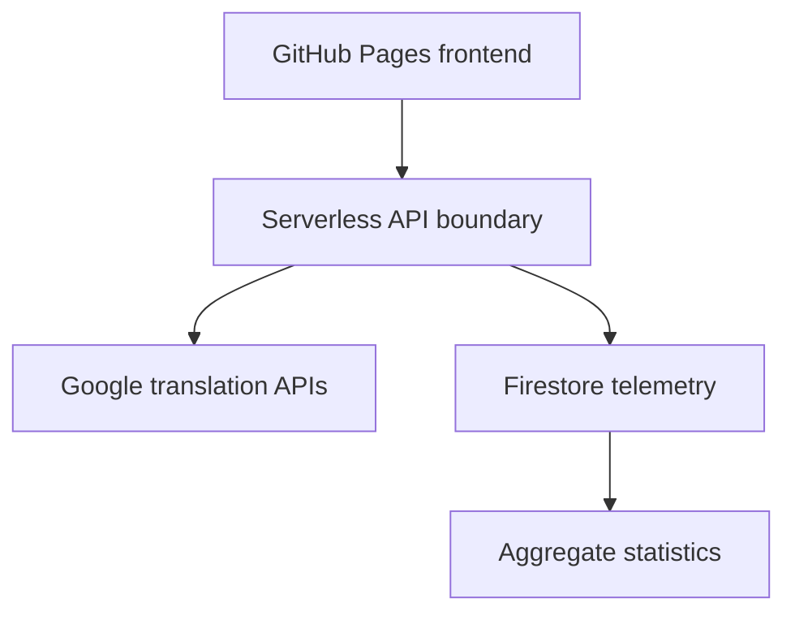

# Architecture

Version: 0.1 draft

Date: 2026-09-15

## 1. Architecture objectives

- Keep the core understandable to junior developers.
- Separate subtitle-domain logic from React and provider HTTP code.
- Preserve a static frontend deployment while that is sufficient.
- Add a backend only for secrets, durable background jobs, shared data, or enforceable quotas.
- Avoid microservices unless future measured needs justify independent services.

## 2. Recommended evolution

### Phase A - client-first modular application

React + TypeScript + Vite + Ant Design on GitHub Pages. Parsing, formatting, editing, quality checks, and serialization run locally. Translation providers sit behind one interface. Job checkpoints use IndexedDB/local persistence. This phase can resume work after reload but cannot guarantee execution while the browser freezes or closes the tab.



### Phase B - optional serverless backend

Use a small backend boundary when needed for production keys, telemetry ingestion/aggregation, or approved enforceable limits. Current project cloud persistence is telemetry only. Firestore stores approved completion metadata and aggregates; it does not store subtitle bodies or completed files. A translation proxy may transiently forward required text to the selected provider without retaining it in project databases, logs, or object storage.

This is still one product and can remain a modular monolith/serverless application. It is not necessary to split translation, metadata, statistics, and storage into separately deployed microservices for the class.



### Accepted cloud data boundary — 2026-09-16

See `ADR-001-TELEMETRY-ONLY.md`. No completed SRT storage or reuse is planned now. Retain local downloads and checkpoints. Collect country and city, target language, and movie identity, with a minimal event ID/timestamp envelope for deduplication and 30-day aggregation. The acquisition method and retention remain open.

A Spark-only prototype can collect client-reported events under restrictive rules; these are not independently verified successful translations. Trusted ingestion/aggregation needs backend execution. No object-storage provider or bucket is needed for telemetry. File-storage comparisons in the research document are historical.

## 3. Translation data flow

1. Read one file locally.
2. Parse without losing cue identity or timing.
3. Normalize only what is needed for analysis; retain the original representation.
4. Detect dialogue and sentence/group context before translation.
5. Build bounded provider requests with stable IDs.
6. Translate and validate the response schema/count/IDs.
7. Map results to cues without silent loss.
8. Apply language-aware line breaking and quality checks.
9. Store a checkpoint after each validated batch.
10. Allow user edits and mark them as protected.
11. Validate and serialize the final `.srt`.

Retire the legacy "merge sentence, translate once, split by original word ratio" algorithm during the React port. It corrupts boundaries when target-language word order differs. Gemini receives complete continuation groups and neighboring context but returns structured per-cue/per-speaker IDs. Standard Google NMT receives one string per cue, batched in one official request for efficiency; separate strings do not promise document context. In both paths, every provider result maps one-to-one before formatting.

## 4. Core domain model

Suggested concepts, independent of React:

- `SubtitleDocument`: source filename, detected encoding information if supported, ordered cues.
- `SubtitleCue`: stable internal ID, original index, start/end, original text/lines/tags.
- `TranslatedCue`: cue ID, provider output, formatted text, status, edit state, warnings.
- `TranslationJob`: job ID, provider, target language, configuration fingerprint, status, counts, timestamps, retry/cancel state.
- `TranslationBatch`: ordered cue/group references plus bounded context.
- `SubtitleQualityIssue`: cue ID, rule ID, severity, measured value, configured threshold.
- `MovieMetadata`: optional canonical provider/ID, title, year, synopsis, confidence; never inferred as certain from filename alone.
- `ContinuationGroup`: ordered cue IDs plus a visible group boundary; it never owns or rewrites timecodes.
- `ProviderCredential`: non-serializable, volatile tab-memory value scoped to one provider; forbidden from persisted job state.

## 5. Provider boundary

The provider contract should expose capabilities rather than leaking provider-specific UI logic:

```ts
interface TranslationProvider {
  readonly id: string;
  getCapabilities(): Promise<ProviderCapabilities>;
  translateBatch(
    request: TranslationBatchRequest,
    signal: AbortSignal,
  ): Promise<TranslationBatchResult>;
}
```

The exact types belong in code and may evolve. Required invariants are stable input IDs, validated output IDs, explicit language capability, cancellation, categorized errors, and no provider-specific branching in React components.

ADR-002 makes both providers visitor-funded. The credential control constructs the selected adapter in memory, validates it, and never passes the raw value into the reducer, persistence layer, telemetry, URL, or logger. Cloud Translation Basic is the current browser BYOK target. Gemini uses the current official SDK/API with `store=false` and the versioned prompt contract.

## 6. Suggested frontend structure

```text
src/
  app/                    app shell, routing/modes, providers, theme
  components/             shared presentational components
  features/
    translator/           translator UI, state, job orchestration
    statistics/           dashboard UI and queries
  core/
    srt/                  parser, serializer, fixtures
    subtitles/            grouping, line breaking, quality rules
  services/
    translation/          provider contract and provider adapters
    metadata/             optional movie metadata adapter
    persistence/          checkpoints and optional backend adapters
  types/                  truly shared types only
  utils/                  small general helpers only
  test/                   shared test setup and fixtures
```

Do not create folders only to match this diagram. Create them when real code has that responsibility. Feature-local components/types stay inside the feature instead of being made globally shared prematurely.

## 7. State management

Use React state plus a reducer/state machine for the translation job before adding a third-party global state package. Expected states include idle, file-ready, configured, translating, partially-failed, cancelled, completed, and restoring. Derived UI flags such as `canStart` and `canDownload` come from state rather than duplicated booleans.

Persist serializable job data, not DOM elements, provider clients, raw API keys, or `AbortController` instances.

Store `startedAt` and terminal `finishedAt`; derive displayed elapsed time from those timestamps instead of incrementing a counter. Timer throttling can delay repaint but cannot change the calculated elapsed duration. When Start succeeds, the state exposes an active warning card telling the user to keep the tab open and foregrounded.

## 8. Background behavior

### Frontend-only guarantee

- Translation may continue in an ordinary hidden tab, but browsers can throttle timers and can freeze/discard the page.
- Replace artificial per-request timers with a rate-aware queue; timers must not be the progress engine.
- Checkpoint validated batches and restore on reload.
- Save state on `visibilitychange`/freeze-related lifecycle transitions.
- A Web Worker can keep heavy parsing/formatting off the UI thread but does not create a guarantee against page freezing/discard.
- A service worker/background sync is not a general long-running translation-job host.
- Display the active-tab warning throughout the job. On `visibilitychange` to hidden, checkpoint immediately and mark the UI to explain a possible pause when the user returns.

### Guaranteed completion

Durable jobs requiring server-persisted subtitle text are deferred under the telemetry-only decision. If closed-tab completion becomes a confirmed requirement, first revisit this data boundary explicitly. Current recovery uses browser-local checkpoints and does not promise continued execution while closed.

## 9. Subtitle grouping and formatting architecture

Keep translation and presentation formatting separate.

`docs/SUBTITLE_FORMATTING_SPEC.md` is normative. The UI renders compact spacing inside each continuation group, at least twice that space between groups, and a non-color shared group indicator. Hovering either column highlights the paired row; edit state persists with a stronger visual treatment.

The formatter must:

- preserve intentional dialogue structure;
- count Unicode grapheme clusters/appropriate display units;
- allow language-specific profiles;
- score candidate two-line breaks using length, balance, punctuation, and prohibited split points;
- calculate CPS from cue duration;
- return formatted text plus warnings;
- never hide overflow by producing unlimited lines;
- never rewrite timecodes unless a separately approved retiming feature is active.
- force source-detected `- <Unicode uppercase...>` speaker boundaries before any balancing decision;
- enforce the default 42-grapheme/two-line profile and calculate 20-CPS adult or 17-CPS children's limits;
- return `needs-review` when capacity cannot be met without losing meaning.

The quality checker should flag cues that need human editing. Automatic rules cannot infer perfect syntax in every supported language.

## 10. Data and privacy boundaries

1. Local job state contains subtitle content for editing, download, and checkpoint/resume.
2. Translation requests contain the text needed by the selected provider; avoid retention in project logs or persistence.
3. Cloud telemetry contains country and city, language, movie identity, and the minimal event envelope.

Do not send source/translated text, full SRT files, raw filenames, API keys, raw IPs, exact GPS, or full movie URLs to telemetry. Store unknown values explicitly instead of inventing facts. Do not expose raw events publicly; serve bounded aggregate summaries. Collection should have a documented notice and controls; the exact mechanism remains TBD. Telemetry failure must not break local translation/download.

## 11. Movie metadata

The browser parses an IMDb `tt...` title ID from a validated URL. The preferred semester adapter calls TMDB's official Find-by-external-ID endpoint through a boundary that protects its developer credential, subject to terms/attribution. IMDb's official API is a licensed alternative. Rotten Tomatoes documents API/data-feed integration through a business proposal rather than a self-service public API, so current code must not scrape it; use manual title/year when an IMDb ID is unavailable.

Matching should be confidence-based and visible to the user. Cross-user subtitle reuse and its artifact-fingerprint schema are deferred; they are not part of current telemetry.

## 12. Deployment and CI/CD

- `main` is production.
- Pull requests run install-from-lockfile, typecheck, lint, tests, and build.
- Deployment runs only after the same checks pass on `main`.
- GitHub Pages source is GitHub Actions.
- Vite `base` must match the repository subpath.
- Deploy only `dist` with least-privilege Pages permissions.
- Pin dependencies in the lockfile and pin critical Actions to reviewed versions or immutable SHAs according to the team's dependency policy.
- GitHub Pages serves the static frontend only; server code deploys separately.

## 13. Architecture decisions to record later

Use `docs/ADR_TEMPLATE.md` for decisions that alter boundaries, data, security, deployment, or dependencies. Required likely decisions include:

- tested Gemini model and batch budget;
- local-only versus backend job execution;
- telemetry location acquisition method, retention, and deletion;
- metadata provider;
- three-life semantics and identity;
- formatter reference profiles;
- deployment host if backend requirements outgrow static Pages.
