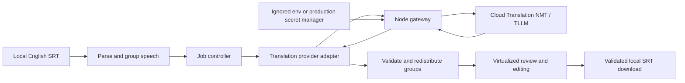

# Architecture

Updated: 2026-09-18 — voice memo revision; ADR-004 and ADR-006 are current.

## Current running system

The app is one React/TypeScript/Vite frontend with a small Node gateway. Ant Design supplies the standard UI, theme and layout. Domain code performs SRT parsing, continuation detection, normalization, redistribution, line wrapping and validation. The gateway owns the Cloud API key and forwards only official NMT/TLLM requests. No browser key field, Gemini adapter, database or subtitle upload store exists.

`npm run dev` starts both processes. Vite proxies `/api` locally; it does not load `.env`. The gateway forwards text transiently and logs only safe error categories/statuses. It is a local development service, not a production service with authentication/rate limiting. Public gateway hosting and enforcement remain open.

## Module responsibilities

| Module | Responsibility |
| --- | --- |
| `src/app/App.tsx`, `theme.ts` | Compact 20/80 shell, system-initial theme, controls and global/component tokens. |
| `src/features/translator/useTranslator.ts` | File/model/job state, automatic language lookup, stale-response cancellation, editing and download. |
| `src/features/translator/job.ts` | Sequential batch orchestration, validated group results, progress/request attempts and failure attribution. |
| `src/core/srt/` | Strict UTF-8 SRT parsing, preserved identities/times, safe supported markup and serialization. |
| `src/core/subtitles/groups.ts` | Shared bounded grouping, structural sections and approximate target-text distribution. |
| `src/core/subtitles/subtitles.ts` | Display grouping, line wrapping, CPS and readability warnings. |
| `src/services/translation/` | Provider interface, exact request preparation, estimates, timeout/retry and response validation. |
| `server/index.mjs` | Private credential boundary and official Google requests. |
| `CueRow.tsx`, `VirtualCueList.tsx` | Paired Ant Design cards, editing, per-cue failure/review and bounded mounted rows. |

No new state-management or theming framework is needed. Standard UI uses Ant Design; virtual positioning and subtitle text/markup retain focused custom code.

## Translation and recovery flow

1. Validate and parse the local file without dropping malformed cues.
2. Load target-language options from the gateway automatically; no paid test translation is required.
3. Build bounded original groups and their speech/speaker/sound units. Remove soft wraps; retain meaningful structure.
4. Estimate the selected model's whole-file usage and pending work from those same inputs.
5. Start only with a valid file/model/language and an explicit reading profile.
6. Send batches of units through the provider; separate `q` strings are separate units, not shared context. Both models receive joined speech within a unit.
7. Validate response count, local unit IDs/order, text and markup/structural markers. Redistribute joined output by capacity and language boundaries, then format each original cue. This is approximate layout, not semantic alignment.
8. Save valid groups and show progress. A provider request failure affects its submitted batch; a redistribution failure affects its group. Later unattempted cues remain waiting. Retry skips completed original groups and preserves edits.
9. Download only when every cue is valid. No blank cue, timing rewrite or lost text is accepted as successful output.

The request counter accumulates translation attempts, including automatic/manual retries. Language discovery is not a translation attempt. Timer semantics and exact successful test results are recorded with the implementation evidence. Cancellation/reset/model changes must reject stale results.

## UI and performance

Shared theme configuration uses `ConfigProvider`; `theme.useToken` exposes dynamic values for custom subtitle styles. The spacing scale uses 8/16/24/32 px for related controls/cards/sections/end padding. This deliberately replaces the earlier isolated 20 px sidebar rule. The header remains 52 px with a theme cue, help modal and repository link. The brand resets workspace state after confirming loss of loaded work.

Desktop controls scroll above a stationary action/progress/download area. The preview heading and source/target labels are compact and sticky. `@tanstack/react-virtual` mounts only visible paired rows plus overscan and retains the editing row. Rendering yields between batches. Tests use a synthetic 2,500-cue file; this is not a claim about every browser or full-film workload.

## Persistence and lifecycle

Current retry keeps completed work only in the open tab. Reload checkpoints are a planned Week 9 task, not implemented behavior. Browsers can throttle, freeze or discard pages; no closed-tab continuation is promised. Keep the active-job warning and stale-result protection.

Cloud subtitle storage, durable cloud jobs, sharing and reuse remain deferred. Telemetry is a conditional future boundary under ADR-001, pending retention, notice and location acquisition decisions. Translation text is never telemetry. Metadata, statistics and lives have no runtime implementation in this increment.

## Deployment and course architecture

GitHub Pages can serve `dist` only. The private gateway requires separate hosting and secret management. Before public translation, define owner budget, allowance, authentication/abuse strategy, server rate/concurrency limits and approved frontend origin. The existing Actions configuration performs checks and frontend deployment; current remote success must be verified separately.

A modular frontend plus one gateway is enough for this solo product. The course's microservices week requires reasoned decomposition discussion, not unnecessary services. Preserve the archived MVP for the before/after demonstration. Superseded credential and mapping designs remain in historical ADRs rather than active instructions.
